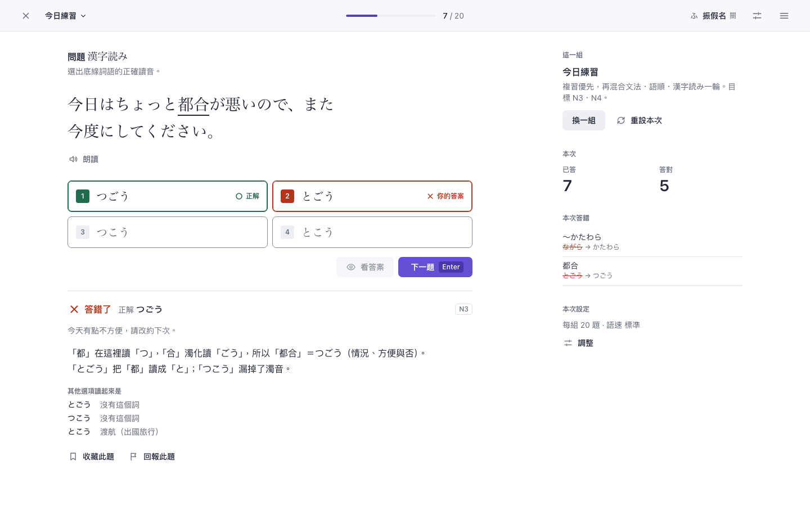

# Jabiko design authority — JT-1

Status: **JT-1 CANDIDATE** for [#850](https://github.com/nurockplayer/Jabiko/issues/850),
submitted for independent review. Once accepted it is the canonical visual and
interaction authority for Jabiko: #838 (Training) and #834/#836 (World shell
and return) implement it and must not redesign it. A genuinely new design
choice found during implementation comes back here as a revision (JT-2, …).

> **Tachiko foundation, Jabiko voice.** Tachiko provides the shared design
> foundation; Jabiko is its learning-product expression.

**Figma (canonical for visual presentation):** the file
**"Jabiko — Tachiko Design Authority"** — 95 editable frames named
`JT-1 CANDIDATE · <board> · <state> · <viewport>`, registered with node IDs and
hashes in [figma-registry.json](figma-registry.json) (link to be recorded in
`tools/figma/policy.mjs` once shared). System boards are on the first page,
all surfaces on the second in labelled rows (VERIFICATION.md §2).



## What is where

| File | What it is |
| --- | --- |
| [DESIGN.md](DESIGN.md) | The specification: tokens and usage rules, layout, the assessment system, components with states, every surface, localization, accessibility, implementation guidance and acceptance checklist |
| [DECISIONS.md](DECISIONS.md) | Decisions D-00 … D-28 with reasons and rejected alternatives; dispositions of #832 and PR #849; REVIEW-CONFIRM items |
| [FOUNDATION.md](FOUNDATION.md) | Exactly which Tachiko authority is consumed (sources, values, rules), what Jabiko specializes, what is excluded as spreadsheet-only |
| [CAPABILITIES.md](CAPABILITIES.md) | Every existing capability → its JT-1 location on wide and compact, with board evidence; protected contracts |
| [tokens.json](tokens.json) | Canonical values: colors (light, dark) with source per role, contrast requirements, type, space, geometry, layers, motion, breakpoints |
| [figma-registry.json](figma-registry.json) | The canonical Figma frames (node IDs, readback and export hashes) — written by `tools/figma/registry.mjs` |
| [reference/](reference/) | Executable design harness: `jabiko.css` recipes, `harness.js`, boards `index`, `foundation`, `components`, `today`, `session`, `sets`, `learn`, `grammar`, `reference`, `talk`, `world`, `system` (states via `?state=`, `?theme=dark`, `?lang=en`) |
| [renders/](renders/) | 95 committed captures (320, 390, 768, 1280, 1440; light, dark, forced colors, English, long content) and, in `renders/figma/`, the native Figma exports |
| [tools/](tools/) | `verify.mjs` (parity, contrast, board checks, D-07 geometry, captures), `scenes.mjs`, `capture.mjs`, `static-server.mjs`, `overflow-probe.mjs`; `figma/` (bridge client, serializer, importer, registry writer, Figma parity check) |
| [VERIFICATION.md](VERIFICATION.md) | What was verified, how, results, review record and what design evidence does not prove |

## Authority precedence (Jabiko presentation)

1. Jabiko product and learning semantics — #810, #830/#831
   ([product boundary](../../jabiko-life-product-boundary.md)), accepted
   children, CLAUDE.md invariants (language isolation, contentGuard, layering).
2. The Tachiko foundation snapshot in FOUNDATION.md (cross-product rules and
   shared role values).
3. JT-1: `tokens.json` for values; the Figma file for visual presentation;
   DESIGN.md for rules and behavior; DECISIONS.md for rationale; harness and
   renders as import source and evidence.
4. Production implementation (#838, #834, #836).

JT-1 supersedes the visual authority of #832 and PR #849 (DECISIONS.md D-00).
It authorizes presentation only (D-24). Nothing under `docs/design/jabiko/`
is imported by `src/`, and Jabiko has no runtime dependency on tachiko-sheet.

## Reviewing

1. Read DESIGN.md §1 and DECISIONS.md D-00, D-02, D-03.
2. Walk the Figma file page by page (00 Index → 70 Shell & System), or skim
   `renders/`, or open the harness (below).
3. Decide the **REVIEW-CONFIRM** items: **D-07** (feedback below the options,
   replacing #473's order), **D-14** (one seasonal topic on Today), **D-22**
   (World label "日常").
4. Check against #850's list: lost capabilities (CAPABILITIES.md), divergence
   from Tachiko (FOUNDATION.md), template patterns (D-23), responsive /
   keyboard / accessibility reality (DESIGN.md §9, VERIFICATION.md),
   spreadsheet semantics (FOUNDATION.md §5), implementation ambiguity
   (DESIGN.md §10).

## Reproducing

```bash
pnpm install --frozen-lockfile
node docs/design/jabiko/tools/verify.mjs
```

The script serves this directory locally, runs every check in Chromium via the
repository's Playwright, regenerates `renders/`, and writes
`verification/report.json`. One board:

```bash
node docs/design/jabiko/tools/capture.mjs --out /tmp/jt 'session.html?state=wrong@390x844'
```

The offline Figma parity check (no Figma connection needed):

```bash
node docs/design/jabiko/tools/figma/verify.mjs
```

Re-importing after a harness change uses the official bridge
(`@gethopp/figma-mcp-bridge` 0.0.22) with its plugin open in the Jabiko file;
`FIGMA_FILE_KEY` is the per-session key `bridge.mjs list_files` reports:

```bash
export FIGMA_BRIDGE_DIR=<npx dir of @gethopp/figma-mcp-bridge@0.0.22> FIGMA_WORK_DIR=<scratch dir>
export HTML_FIGMA_BUNDLE=<html-figma 0.3.1 bundle, SHA-256 pinned in tools/figma/policy.mjs>
node docs/design/jabiko/tools/figma/serialize.mjs
FIGMA_FILE_KEY=<bridge key> node docs/design/jabiko/tools/figma/import.mjs --replace
node docs/design/jabiko/tools/figma/registry.mjs
FIGMA_FILE_KEY=<bridge key> node docs/design/jabiko/tools/figma/verify.mjs --live
```
