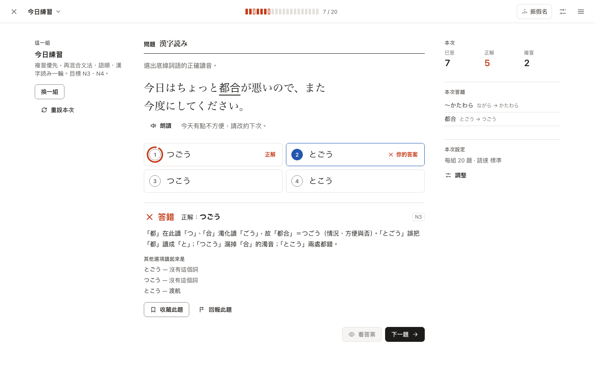

# Jabiko Learning design authority — Shu-ire (朱入れ) SI-1

Status: **proposed canonical design authority** for the Jabiko Learning
(Training) redesign, submitted for independent review. Once accepted, #838
implements it; implementation must not redesign it independently. If
implementation exposes a genuinely new design choice, bring it back here as a
revision (SI-2, …) instead of improvising in code.

> The page is the learner's; the red ink is Jabiko's.



## Contents

| File | What it is |
| --- | --- |
| [DESIGN.md](DESIGN.md) | The specification: thesis, tokens and usage rules, mark system, components with state tables, every surface, localization, accessibility, implementation guidance and acceptance checklist |
| [DECISIONS.md](DECISIONS.md) | Consequential decisions (D-01 … D-21) with reasons, rejected alternatives and REVIEW-CONFIRM items |
| [AUDIT.md](AUDIT.md) | Current-product capability inventory and protected contracts the redesign must keep; why the old presentation is retired |
| [FOUNDATION-SNAPSHOT.md](FOUNDATION-SNAPSHOT.md) | Exact Tachiko authority consumed (node IDs, hash-verified exports), inherited / specialized / excluded rules |
| [tokens.json](tokens.json) | Canonical values: color roles (light + dark), contrast requirements, type roles, spacing, geometry, elevation, motion, breakpoints |
| [reference/](reference/) | Render-first design harness: `shu-ire.css` (executable recipes), `harness.js`, and boards `specimen`, `today`, `session`, `sets`, `learn`, `grammar`, `reference`, `talk`, `system` (states via `?state=`), plus `index.html` |
| [renders/](renders/) | 58 committed review renders (320, 390, 1280, 1440; light, dark, forced colors, English) |
| [tools/](tools/) | `verify.mjs` (parity, contrast, board checks, captures), `capture.mjs`, `static-server.mjs` |
| [verification/report.json](verification/report.json) | Machine-readable result of the last verification run |
| [VERIFICATION.md](VERIFICATION.md) | What was verified, how, results, and what design evidence does not prove |

## Authority precedence (for Jabiko Learning presentation)

1. Jabiko product and learning semantics — #810, #830/#831
   ([product boundary](../../jabiko-life-product-boundary.md)), accepted
   children, CLAUDE.md invariants (language isolation, contentGuard, layering).
2. The Tachiko foundation snapshot in FOUNDATION-SNAPSHOT.md (cross-product
   rules only).
3. This directory: `tokens.json` for values; DESIGN.md for rules and behavior;
   DECISIONS.md for rationale; boards and renders as reference evidence.
4. Production implementation (#838 and follow-ups).

The design authorizes presentation changes only. It does not authorize route,
learning-behavior, data, analytics, ad-policy or localization-rule changes
(AUDIT §2); where DESIGN.md names a small domain change (navigation grouping,
retiring `doneSpot`, an additive language-source helper) that change still
goes through TDD in #838.

## Reviewing

1. Read DESIGN.md §1 (thesis) and skim `renders/` (or open `reference/index.html`).
2. Check the REVIEW-CONFIRM decisions in DECISIONS.md: **D-03** (one-hue
   marks, 〇 in vermilion for correct), **D-07** (feedback below marked options,
   superseding #473's DOM order), **D-14** (seasonal topic on Today).
3. Use the #832 review contract: design-authority reconciliation (reuses, does
   not duplicate Tachiko; no spreadsheet semantics), product/learning,
   accessibility, originality (all marks, layouts and icons here are original;
   the only reused art is Jabiko's own mascot).

## Reproducing

```bash
pnpm install --frozen-lockfile
node docs/design/learning/tools/verify.mjs
```

The script starts a local static server for this directory, runs every check
in Chromium via the repository's Playwright, regenerates `renders/`, and
writes `verification/report.json`. To look at a single board:

```bash
node docs/design/learning/tools/capture.mjs --out /tmp/si 'session.html?state=wrong@390x844'
```

Nothing under `docs/design/learning/` is imported by `src/`.
